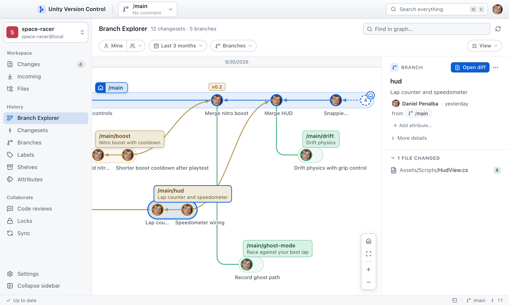

<p align="center">
  
</p>

<h1 align="center">Unity Version Control — Desktop</h1>

<p align="center">
  A fast, calm desktop client for <a href="https://unity.com/solutions/version-control">Unity Version Control</a> (formerly Plastic SCM).<br>
  Branches, merges, shelves and code reviews that feel effortless, on macOS, Windows and Linux.
</p>

<p align="center">
  <a href="https://github.com/Unity-Technologies/uvcs-desktop-client/releases/latest"><b>Download</b></a> ·
  <a href="#whats-inside">What's inside</a> ·
  <a href="#build-from-source">Build from source</a> ·
  <a href="#feedback">Feedback</a>
</p>

<p align="center">
  
</p>

## Download

| macOS                          | Windows              | Linux            |
| ------------------------------ | -------------------- | ---------------- |
| `.dmg`, Apple silicon or Intel | `.exe`, x64 or Arm64 | `.AppImage`, x64 |

Get the one for your computer from the [latest release](https://github.com/Unity-Technologies/uvcs-desktop-client/releases/latest).
The app keeps itself up to date from new releases.

<details>
<summary><b>The first launch asks for permission</b> (the builds aren't code-signed yet)</summary>

- **macOS**: open System Settings ▸ Privacy & Security and click Open Anyway.
- **Windows**: if SmartScreen warns about an unknown publisher, click More info ▸ Run anyway.

</details>

## Get started

1. Install [Unity Version Control](https://unity.com/solutions/version-control) and sign in once, from the official
   client or by running `cm` in a terminal. The app runs `cm` for you, so it works with every server `cm` can reach,
   cloud or on-premises.
2. Open the app and pick a workspace, or drop its folder on the window.

The app finds `cm` in the standard install locations and on your `PATH`. To use another one, set `UVCS_CM_PATH`.

Three shortcuts get you everywhere (Ctrl instead of ⌘ on Windows and Linux):

| Keys | What it does                                             |
| ---- | -------------------------------------------------------- |
| ⌘K   | Search everything: branches, changesets, files, commands |
| ⌘/   | List every keyboard shortcut                             |
| ⌘⇧L  | Show every `cm` command the app ran                      |

## What's inside

- **Branch Explorer**: the whole history as a graph you can pan, zoom and search, fast even on repositories with
  hundreds of thousands of changesets.
- **Changes**: check in, undo and shelve, and edit a file right in its diff. Mark files reviewed as you go.
- **Switch with changes**: your pending changes come with you to another branch, or wait for you on this one.
- **Merge**: see the result before anything is written, and resolve conflicts in the app or in the merge tool you
  already use.
- **Code reviews**: create, review and comment without leaving the app.
- **Shelves, labels, attributes, locks and sync**: each in a view of its own, with the same lists and filters.
- **Files and history**: browse any changeset, see a file's history, and annotate it line by line.
- **One window per workspace**: work on several tasks side by side, each in its own workspace and branch.
- **Light and dark themes** that follow your system.

It's built to be kind to the server: most `cm` commands are a round trip to a server many people share, so the app
runs each one only when needed, asks for many things in one command, and keeps what doesn't change.

## Privacy

No telemetry, analytics or crash reports. Besides the `cm` commands to your own servers, the app connects to two places:

- **gravatar.com**, for profile pictures, as the official clients do: it sends a hash of each email address shown.
  Turn the pictures off in Settings ▸ Appearance, and initials show instead.
- **github.com**, to check this repository's releases for updates and download them. Nothing about you is sent.

Settings and review marks stay on your computer.

## Build from source

You need **Node.js 22.12 or newer**, and `cm` installed and signed in.

```sh
git clone https://github.com/Unity-Technologies/uvcs-desktop-client.git
cd uvcs-desktop-client
npm install      # also downloads Electron
npm run dev      # the app, with hot reload
```

| Command                      | What it does                                   |
| ---------------------------- | ---------------------------------------------- |
| `npm run build && npm start` | Builds the app into `out/` and runs that build |
| `npm run typecheck`          | Type-checks the main and renderer code         |
| `npm test`                   | Runs the unit tests (a few seconds)            |
| `npm run dist`               | Builds the installer for this OS into `dist/`  |

[docs/ARCHITECTURE.md](docs/ARCHITECTURE.md) explains how the code is organized, and [CONTRIBUTING.md](CONTRIBUTING.md)
how to send a change.

<details>
<summary><b>Building on Linux</b></summary>

- Electron needs the usual desktop libraries (`libnss3`, `libgtk-3-0t64`, `libgbm1`, `libasound2t64` on
  Ubuntu 24.04; a desktop install has them).
- Chromium's sandbox helper must belong to root with the setuid bit, or Electron won't start (Ubuntu 24.04 restricts
  unprivileged user namespaces). After `npm install`:
  `sudo chown root:root node_modules/electron/dist/chrome-sandbox && sudo chmod 4755 node_modules/electron/dist/chrome-sandbox`.
- Without a display (CI, SSH), run it on a virtual one: `xvfb-run -a -s "-screen 0 1600x1000x24" npm start`.
- Workspaces are watched a folder at a time, one inotify watch each (folders `ignore.conf` names are skipped). A tree
  of more than 10,000 folders, or a full `fs.inotify.max_user_watches`, is watched in part: raise the limit with
  `sudo sysctl fs.inotify.max_user_watches=524288` (and in `/etc/sysctl.d/` to keep it).

</details>

## Feedback

Found a problem or missing something? Open an [issue](https://github.com/Unity-Technologies/uvcs-desktop-client/issues).
In the app, About ▸ Report an Issue fills in your versions for you, and so does an error's Details ▸ Report an Issue.

Report a security vulnerability privately instead: see [SECURITY.md](SECURITY.md).

## Maintenance

The Unity Version Control team at Unity Technologies maintains this repository: it reads new issues and pull
requests, fixes security reports first, and ships fixes as new releases. Contributions are welcome under the
[Unity Contribution Agreement](CONTRIBUTING.md). The repository is reviewed against Unity's standards for public
repositories once a year, and again whenever it takes in new third-party code or changes the data it handles.

## License

[Apache License 2.0](LICENSE.md), copyright Unity Technologies (see [NOTICE](NOTICE)). The installed app lists the
open-source libraries it includes, with their licenses, in `THIRD_PARTY_NOTICES.txt`.

"Unity" and "Unity Version Control" are trademarks of Unity Technologies. The license grants no rights to them.
